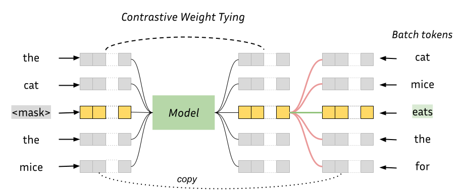

# headless-lm: Better and Faster LM pretraining
This repository contains training and evaluation code for the paper ["Headless Language Models: Learning without Predicting with Contrastive Weight Tying"](https://arxiv.org/abs/2309.08351).

Paper abstract:
> Self-supervised pre-training of language models usually consists in predicting probability distributions over extensive token vocabularies. In this study, we propose an innovative method that shifts away from probability prediction and instead focuses on reconstructing input embeddings in a contrastive fashion via Constrastive Weight Tying (CWT). We apply this approach to pretrain Headless Language Models in both monolingual and multilingual contexts. Our method offers practical advantages, substantially reducing training computational requirements by up to 20 times, while simultaneously enhancing downstream performance and data efficiency. We observe a significant +1.6 GLUE score increase and a notable +2.7 LAMBADA accuracy improvement compared to classical LMs within similar compute budgets.

<br>



## Install environment

Make sure you have Python>=3.9 and Cuda>=11.2 installed. Then run:
```bash
pip install -r requirements.txt
```

## Preprocess data
Adapt the config file in `configs` to your specific case, and then run `preprocess.py --config=configs/your_config_file.json`.

## Training
### Encoder
To train an encoder model:
1. Write/edit model-related parameters in a config file similar to `configs/mlm_headless.json`
2. Run the following command with your specific arguments:
```bash
python mlm_headless.py \
    --config configs/your_config_file.json \
    --num_nodes your-gpu-node-count \
    --global_bs your-accumulated-batch_size \
    --gpu_bs your-per-device-batch-size \
    --dataset your-preprocessed-output.hf \
    --hf_tokenizer your-tokenizer \
    --hf_path path-to-your-model-arch-on-HF \
    --model_max_seq_len models-max-pos-embeddings \
    --run_name run-name-for-logging-and-ckpts \
    --saved_ckpt_path where-to-save-ckpts
```
Other args include `--accelerator` (`hf`, `xformers` or `flash_attention`), `--ckpt_every` to pick checkpoint frequency, among others.

3. Pick your checkpoint and publish it to HuggingFace:
```python
python hf_publisher.py \
    --hf_name your_hf_id/your_model \
    --model_ckpt your_model.ckpt \
    --mode mlm
```
### Decoder
To train a decoder model:
1. Write/edit model-related parameters in a config file similar to `configs/gpt_headless_70m.json`
2. Run the following command with your specific arguments:
```bash
python gpt_headless.py \
    --config configs/your_config_file.json \
    --num_nodes your-gpu-node-count \
    --global_bs your-accumulated-batch_size \
    --gpu_bs your-per-device-batch-size \
    --dataset your-preprocessed-output.hf \
    --hf_tokenizer your-tokenizer \
    --hf_path path-to-your-model-arch-on-HF \
    --model_max_seq_len models-max-pos-embeddings \
    --run_name run-name-for-logging-and-ckpts \
    --saved_ckpt_path where-to-save-ckpts
```
Other args include `--accelerator` (`hf`, `xformers` or `flash_attention`), `--ckpt_every` to pick checkpoint frequency, among others.

3. (optional) Pick your checkpoint and publish it to HuggingFace. You'll need to use the `add_head` option to make it able to output tokens:
```python
python hf_publisher.py \
    --hf_name your_hf_id/your_model \
    --model_ckpt your_model.ckpt \
    --mode add_head
```

4. The resulting model will probably perform poorly for language generation. Why? Because it was not trained to do it! To turn your contrastive model into a good LM, you'll need add a head and fine-tune it. Setup a config file in the style of `config/gpt_vanilla_ft.json` and run:
```
python ft_gpt_headless.py \
    --config configs/your_ft_config.json \
    ...
    (same args as above, but you may want different values)
```

5. Pick your fine-tuned checkpoint and publish it to HuggingFace. You don't need to use the `add_head` option anymore as you just trained one:
```python
python hf_publisher.py \
    --hf_name your_hf_id/your_model \
    --model_ckpt your_model.ckpt \
    --mode lm
```

## Evaluation
You can now use any zero-shot or fine-tuning code to evaluate your models. We provide our GLUE fine-tuning script in `glue_finetuning.py`, and we used the [LM Eval Harness](https://github.com/EleutherAI/lm-evaluation-harness) for zero-shot evaluation.

## Citation
This repo contains the code that was used for the experiments of the paper ["Headless Language Models: Learning without Predicting with Contrastive Weight Tying"](https://arxiv.org/abs/2309.08351).

```bibtex
@misc{godey2023headless,
      title={Headless Language Models: Learning without Predicting with Contrastive Weight Tying}, 
      author={Nathan Godey and Éric de la Clergerie and Benoît Sagot},
      year={2023},
      eprint={2309.08351},
      archivePrefix={arXiv},
      primaryClass={cs.CL}
}
```
